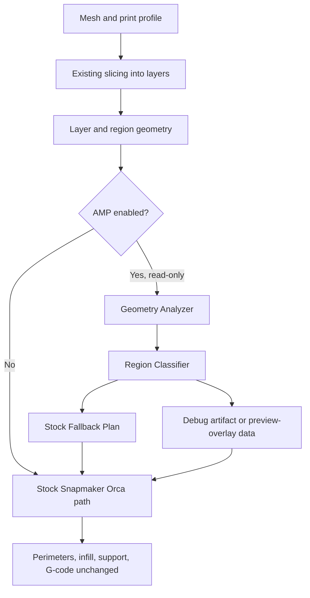

# Adaptive Manufacturing Planner v0.2

## Purpose

Adaptive Manufacturing Planner v0.2 defines how the planner should exist inside Snapmaker Orca before it is allowed to control slicing behavior. The planner is intended to become a decision layer that evaluates model geometry, print profile constraints, available U1 tools, material limits, user priorities, and confidence before later stages alter bead widths or tool assignments.

The v0.2 milestone is architecture and validation infrastructure. It should make the planner observable, testable, and safe to integrate without requiring any G-code, toolpath, nozzle, firmware, or printer-side behavior changes.

The read-only prototype is a visibility and validation tool, not a manufacturing behavior change.

## Scope

v0.2 covers:

- Planner module boundaries.
- Planner lifecycle and ownership.
- Data structures for region classification, scoring, recommendations, and debug output.
- Integration points where the planner can observe geometry.
- Debug and preview output formats for validating future recommendations.
- Test strategy and pass/fail criteria for a no-G-code-change prototype.
- Future extension points for bead-width planning, tool/nozzle selection, and plugin-style optimization modules.

v0.2 does not require a working optimization algorithm. It establishes a stable place for one to live.

## Non-goals

v0.2 must not:

- Change generated toolpaths.
- Change generated G-code.
- Change profile defaults.
- Alter `Flow`, `PerimeterGenerator`, Arachne, infill generation, support generation, tool assignment, or G-code emission behavior.
- Bypass nozzle mismatch checks, firmware safety behavior, or Snapmaker validation paths.
- Claim physical mixed-nozzle behavior works without U1 hardware validation.
- Treat preliminary planner recommendations as authoritative manufacturing instructions.

## Relationship to v0.1

v0.1 established the staged project direction:

- Stage 1: adaptive bead widths using existing software capabilities.
- Stage 2: adaptive physical nozzle selection after U1 hardware validation.
- Stage 3: global manufacturing optimization across regions, tools, layers, and priorities.

v0.1 also identified key code anchors:

- `PrintConfig` options are declared in `src/libslic3r/PrintConfig.hpp` and defined in `src/libslic3r/PrintConfig.cpp`.
- Process profile JSON is loaded through `src/libslic3r/Config.cpp` and `src/libslic3r/Preset.cpp`.
- Arachne receives outer and inner bead-width inputs through `PerimeterGenerator::process_arachne()` and `Arachne::WallToolPaths`.
- Nozzle diameter is read through flow construction and wall-generation paths such as `LayerRegion::flow(...)`, `Flow::new_from_config_width(...)`, `PerimeterGenerator::process_arachne()`, and `Arachne::make_paths_params(...)`.

v0.2 answers the next question: how the planner is represented, owned, observed, and tested inside the slicer before it changes anything.

## Planner lifecycle

The planner should have an explicit lifecycle:

1. Configuration is loaded through existing profile/config paths.
2. Object and layer geometry is produced by the normal slicing pipeline.
3. If the experimental planner flag is disabled, no planner object is required and slicing continues through the stock path.
4. If the flag is enabled in read-only mode, the planner receives geometry and profile context.
5. The planner creates a stock fallback plan and optional provisional region scores.
6. The planner writes debug artifacts or preview-overlay data.
7. The normal slicer path continues without consuming planner recommendations.

The read-only planner may observe and report. It must not become part of the required path for stock slicing.

## Pipeline placement

The planner should run after model geometry has been sliced into object/layer/region surfaces and before future perimeter, infill, support, or tool-assignment decisions would consume planner output.

For the read-only prototype, the safest insertion point is near `PrintObject` or `LayerRegion` scope where layer and region geometry can be inspected without changing flow construction or perimeter generation.

Recommended conceptual flow:



Future behavior-changing stages may consume planner output before `LayerRegion::make_perimeters()` constructs `PerimeterGenerator`, but v0.2 must stop at debug visibility.

## Data ownership

The planner should not mutate existing geometry, config objects, or generated toolpaths.

Ownership model:

- Existing slicer objects retain ownership of mesh, layer, region, surface, flow, toolpath, and G-code data.
- The planner owns only derived analysis and recommendation data.
- Planner outputs should reference existing object/layer/region identifiers where possible.
- Debug artifacts should be serializable without requiring ownership of slicer internals.
- Later behavior-changing stages must consume copied or value-type planner recommendations rather than letting the planner directly mutate generation classes.

This keeps the planner removable, testable, and safe to disable.

## Proposed data structures

### AdaptiveManufacturingPlan

Top-level result for one print object or one planner run.

Fields:

- `plan_version`
- `object_id`
- `planner_mode`
- `enabled`
- `generated_at_stage`
- `regions`
- `recommendations`
- `fallback_reason`
- `confidence`
- `debug_artifacts`

### AMPRegion

A planner-owned description of a geometry region.

Fields:

- `region_id`
- `object_id`
- `layer_id`
- `print_region_id`
- `bounds`
- `area`
- `perimeter_length`
- `surface_roles`
- `geometry_features`
- `scores`
- `confidence`

### AMPRegionScores

Normalized scores used for provisional classification.

Fields:

- `detail_score`
- `structural_score`
- `cosmetic_visibility_score`
- `accessibility_score`
- `toolchange_penalty`
- `time_savings_potential`
- `classification_confidence`

### AMPRecommendation

A non-authoritative recommendation for future stages.

Fields:

- `region_id`
- `strategy`
- `preferred_bead_width`
- `preferred_nozzle_diameter`
- `preferred_extruder_id`
- `fallback_strategy`
- `reason_code`
- `confidence`

### AMPDebugRecord

Serializable record for debug JSON, CSV, or preview-overlay export.

Fields:

- `object_id`
- `layer_id`
- `region_id`
- `classification`
- `scores`
- `recommendation`
- `fallback_reason`
- `source`

## Planner inputs

Initial read-only inputs:

- Object identifier.
- Layer identifier.
- Print region identifier.
- Layer/region surface geometry after slicing.
- Effective `PrintConfig`, `PrintObjectConfig`, and `PrintRegionConfig`.
- Nozzle diameter list from existing config.
- Wall generator setting.
- Existing role/surface labels available before toolpath generation.

Future inputs:

- Filament calibration confidence.
- U1 tool availability and nozzle/toolhead state.
- Modifier volumes and painted attributes.
- Cosmetic visibility hints.
- Tool-change and purge-cost estimates measured on U1 hardware.
- User priority preset.

## Planner outputs

Initial read-only outputs:

- Stock fallback plan.
- Region scores.
- Region classification labels.
- Debug JSON artifact.
- Optional CSV artifact for spreadsheet inspection.
- Optional preview-overlay payload for later UI work.

Future behavior-changing outputs:

- Bead-width plan.
- Tool/nozzle assignment plan.
- Layer-height plan.
- Confidence and fallback map.

The read-only prototype must emit these as observations only. No generator should consume them to alter manufacturing behavior in v0.2.

## Region scoring model

The initial scoring model should be simple, deterministic, and explainable. It is not an optimizer.

Candidate scores:

- `detail_score`: higher for small islands, short contours, narrow features, high perimeter-to-area ratio, or feature sizes near nozzle limits.
- `structural_score`: higher for large connected areas, load-bearing modifier regions, high wall density, or internal shell areas.
- `cosmetic_visibility_score`: conservative default for external surfaces; lower for internal infill or support-like regions.
- `accessibility_score`: higher when a region can be reached by a candidate strategy without excessive tool changes or path fragmentation.
- `time_savings_potential`: higher for large internal areas where wider beads or larger nozzles may reduce extrusion path length later.
- `toolchange_penalty`: higher when a recommendation would require isolated tool changes or small savings.

For v0.2, all scores may be approximate and must carry reason codes. Unknown inputs should lower confidence and prefer stock fallback.

## Bead-width planning model

The v0.2 architecture reserves a bead-width planning model but does not allow it to alter slicing.

Future Stage 1 model:

- External perimeters default to stock width unless confidence is high.
- Internal perimeters may be eligible for wider effective widths.
- Sparse infill and internal solid infill may be eligible for wider effective widths.
- Top surfaces remain conservative unless visual validation supports changes.
- Recommendations must respect existing line-width settings, material limits, flow limits, and Arachne constraints.

Future Arachne bridge:

- Planned outer width can map conceptually to `bead_width_0`.
- Planned inner width can map conceptually to `bead_width_x`.
- The bridge should be explicit and tested before any generated paths are allowed to change.

## Tool/nozzle planning model

The v0.2 architecture reserves tool/nozzle planning but treats all physical mixed-nozzle behavior as unvalidated until U1 hardware is available.

Future Stage 2 model:

- Small nozzle candidates for visible detail, text, small holes, and fine external contours.
- Larger nozzle candidates for inner shells, sparse infill, internal solid infill, and supports.
- Tool-change cost must include travel, purge, warmup/cooldown if applicable, calibration state, and reliability penalties.
- The planner must use Snapmaker's validation paths rather than replacing them.
- A mixed-nozzle recommendation without hardware validation is advisory only.

## Confidence and fallback behavior

The planner should prefer stock behavior whenever confidence is low.

Fallback rules:

- If the planner is disabled, stock behavior is used.
- If geometry analysis fails, stock behavior is used and the failure is logged in debug output.
- If a score is ambiguous, stock behavior is recommended.
- If a proposed strategy conflicts with existing safety checks, stock behavior is recommended.
- If tool/nozzle state is unavailable, mixed-nozzle recommendations are suppressed.

Confidence should be visible in debug output so reviewers can see why the planner did or did not recommend a future strategy.

## Debug/preview output

The read-only prototype should emit a machine-readable debug artifact before any UI overlay is required.

Recommended first format: JSON.

Example shape:

```json
{
  "plan_version": "0.2",
  "mode": "read_only",
  "object_id": 0,
  "layers": [
    {
      "layer_id": 0,
      "regions": [
        {
          "region_id": "0:0:0",
          "classification": "stock_fallback",
          "scores": {
            "detail_score": 0.0,
            "structural_score": 0.0,
            "cosmetic_visibility_score": 0.0,
            "accessibility_score": 0.0,
            "toolchange_penalty": 1.0,
            "time_savings_potential": 0.0,
            "classification_confidence": 1.0
          },
          "recommendation": {
            "strategy": "stock",
            "reason_code": "read_only_no_behavior_change"
          }
        }
      ]
    }
  ]
}
```

Optional later formats:

- CSV for quick review.
- SVG per layer for static visualization.
- Preview-overlay payload for UI coloring.

Preview colors should be treated as planner diagnostics, not confirmed manufacturing assignments.

## Integration boundaries

v0.2 boundaries:

- `PrintConfig`: may define a hidden experimental flag in a later code milestone.
- `PrintObject` or `LayerRegion`: may host read-only planner invocation in a later code milestone.
- `AdaptiveManufacturingPlanner`: owns geometry analysis and classification.
- `AdaptiveManufacturingPlan`: owns planner outputs and debug serialization.
- Preview/UI layer: may consume debug records later, but must not infer manufacturing behavior from them.

Classes that must remain behaviorally unchanged in v0.2:

- `Flow`
- `LayerRegion::flow(...)`
- `PerimeterGenerator`
- `Arachne::WallToolPaths`
- Infill generation
- Support generation
- Tool assignment
- G-code generation
- Snapmaker nozzle validation paths

## Safety constraints

Safety constraints are part of the architecture, not a later polish item.

- Do not bypass nozzle mismatch checks.
- Do not bypass firmware safety behavior.
- Do not suppress printer-side validation.
- Do not ship profile defaults that imply mixed physical nozzles are validated.
- Do not change behavior when the planner flag is disabled.
- Do not let debug recommendations become G-code decisions without explicit future work.
- Do not claim U1 mixed-nozzle workflows are supported before hardware testing.

## Test strategy

v0.2 documentation supports a future test ladder:

1. Config parsing tests for the hidden experimental flag.
2. Unit tests for planner data structures and default stock fallback plan.
3. Serialization tests for debug JSON.
4. Disabled-behavior tests showing planner-off output remains equivalent to stock behavior.
5. Read-only enabled tests showing debug output is produced while generated toolpaths remain unchanged.
6. Geometry scoring tests using simple synthetic regions.
7. Preview-overlay data tests after UI integration begins.

Behavior-changing bead-width or tool-assignment tests are out of scope until after the read-only path is stable.

## Open questions

- Which existing object/layer identifiers are stable enough for debug artifacts?
- Should the first debug artifact be written per object, per plate, or per slicing run?
- Where should developer-only planner artifacts be stored in the existing output workflow?
- What is the preferred Snapmaker UX for an experimental planner flag?
- Which U1 hardware signals are available to slicer-side validation for nozzle/toolhead state?
- What minimum set of real functional test parts should be used for Snapmaker review?

## v0.2 exit criteria

The v0.2 milestone is complete when:

- The architecture document defines planner boundaries, ownership, inputs, outputs, scoring, fallback behavior, debug output, integration boundaries, safety constraints, tests, and open questions.
- The read-only prototype implementation plan defines a first module path that can observe geometry and emit debug output without changing toolpaths.
- The docs explicitly state that the read-only prototype is a visibility and validation tool, not a manufacturing behavior change.
- No slicer behavior changes are included in the milestone.
- No safety checks are disabled or bypassed.
