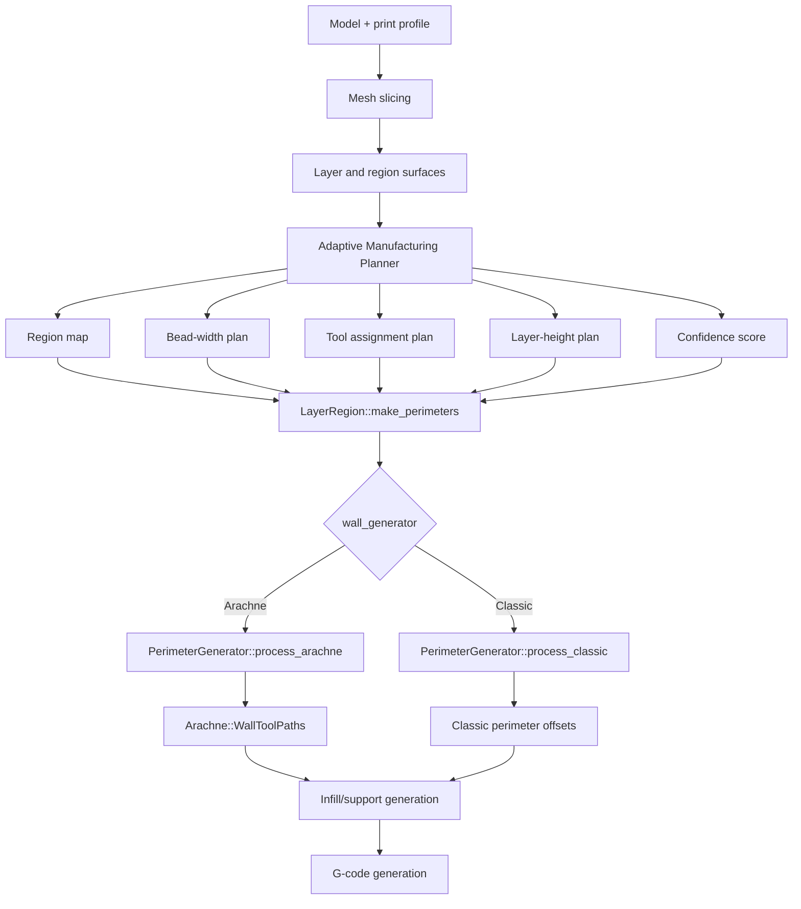

# Adaptive Manufacturing Planner Design Specification v0.1

## Purpose

The Adaptive Manufacturing Planner is a proposed planning layer for Snapmaker U1 slicing. It should decide how aggressively to trade detail, strength, print time, and tool-change cost before the slicer generates final toolpaths.

The project should avoid presenting "variable nozzle diameter" as the first implementation. Stage 1 is adaptive bead width planning. Stage 2 is adaptive nozzle/tool selection on multi-tool U1 hardware. Stage 3 is global manufacturing optimization across regions, layers, tools, and user priorities.

## Goals

- Preserve cosmetic detail where it is visible or geometrically important.
- Increase throughput where wider beads or larger nozzles are unlikely to harm the part.
- Keep planning logic separate from Arachne, classic perimeters, infill generation, and G-code emission.
- Use existing Snapmaker Orca settings and safety checks wherever possible.
- Produce explainable output: region map, tool assignment, bead-width plan, layer-height plan, and confidence score.

## Non-Goals For v0.1

- Do not bypass nozzle mismatch checks.
- Do not require firmware changes.
- Do not implement physical nozzle switching inside a single toolhead.
- Do not rewrite Arachne or the perimeter generator.
- Do not ship experimental profile values as production U1 defaults.

## Staged Capability Model

### Stage 1: Adaptive Bead Widths

Software-only. The planner computes effective line-width recommendations by region and print role, then feeds them into existing flow and wall-generation machinery.

Primary target:

- Outer walls and visible top surfaces keep detail-oriented widths.
- Inner walls, sparse infill, and internal solid infill may widen when confidence is high.

### Stage 2: Adaptive Nozzle Selection

U1 hardware-backed. The planner selects among available physical nozzles/toolheads for roles or regions.

Primary target:

- Small nozzle for cosmetic/detail regions.
- Medium or large nozzle for structural shells, infill, and supports.

### Stage 3: Manufacturing Optimization

Global planner. The planner evaluates alternative region/tool/layer strategies against user priorities and estimated costs.

Primary target:

- Minimize print time for a required quality/strength floor.
- Limit tool changes when savings are too small.
- Prefer robust plans when calibration confidence is low.

## Pipeline Placement

The planner should run after the model has been sliced into layer geometry and before perimeter/infill/support toolpaths are generated.

Current relevant flow:

- `Print::process()` schedules object work.
- `PrintObject::make_perimeters()` generates perimeters for each object.
- `LayerRegion::make_perimeters()` constructs `PerimeterGenerator`, computes flows, and chooses Arachne or classic generation.
- `PerimeterGenerator::process_arachne()` calls `Arachne::WallToolPaths`.
- `Arachne::WallToolPaths` consumes `bead_width_0` and `bead_width_x` plus transition/minimum-width parameters.

Recommended insertion:

- Build the planner at `PrintObject` or `LayerRegion` scope before `LayerRegion::make_perimeters()` constructs `PerimeterGenerator`.
- Store a per-object/per-layer/per-region `AdaptiveManufacturingPlan`.
- In Stage 1, consume that plan inside `LayerRegion::flow()` or just before `PerimeterGenerator` is constructed.
- In Stage 1.5, pass planned outer/inner bead widths into `PerimeterGenerator::process_arachne()` before `Arachne::WallToolPaths` is created.

## Slicing Flow With Planner



## Inputs

### Mesh And Geometry

- Object/layer surfaces from `Layer`, `LayerRegion`, and `SurfaceCollection`.
- ExPolygons and surfaces after slicing but before toolpath generation.
- Optional later inputs: triangle normals, source mesh attributes, modifier volumes, and paint/visibility data.

### Print Profile

- `PrintConfig`
- `PrintObjectConfig`
- `PrintRegionConfig`
- Effective per-layer filament/tool mapping.

### Available Nozzles And Tools

- `PrintConfig::nozzle_diameter`
- U1 machine profile nozzle variants from `resources/profiles/Snapmaker/machine/Snapmaker U1.json`
- Tool/extruder state from existing Snapmaker Orca device validation paths.

### Material

- Filament type, flow ratio, max volumetric speed, temperature limits, support material, and calibration state.
- Existing filament/nozzle rules should remain authoritative.

### User Priorities

Initial priority presets:

- Balanced
- Detail first
- Speed first
- Strength first
- Minimize tool changes

## Outputs

### Region Map

A per-object/per-layer/per-region classification map:

- `region_id`
- `layer_id`
- polygon/expolygon bounds
- role candidates
- detail score
- structural score
- cosmetic visibility score
- accessibility score
- confidence score

### Tool Assignment

Tool/nozzle recommendation by region and role:

- `preferred_extruder_id`
- `preferred_nozzle_diameter`
- `fallback_extruder_id`
- `requires_toolchange`
- `toolchange_cost_estimate`

### Bead-Width Plan

Role-specific widths:

- external perimeter width
- internal perimeter width
- sparse infill width
- internal solid infill width
- top surface width
- support width

### Layer-Height Plan

Optional in v0.1 design, not Stage 1 implementation:

- target layer height
- maximum local layer height
- minimum local layer height
- reason code

### Confidence Score

A normalized score from 0.0 to 1.0:

- high confidence: use optimized plan
- medium confidence: use conservative width changes
- low confidence: use stock profile behavior

## Proposed Data Structures

Use new focused files rather than expanding `PerimeterGenerator.cpp`:

- `src/libslic3r/AdaptiveManufacturingPlanner.hpp`
- `src/libslic3r/AdaptiveManufacturingPlanner.cpp`
- `src/libslic3r/AdaptiveManufacturingPlan.hpp`
- `src/libslic3r/AdaptiveManufacturingPlan.cpp`

Initial C++ shape:

```cpp
namespace Slic3r {

enum class AdaptiveManufacturingPriority {
    Balanced,
    DetailFirst,
    SpeedFirst,
    StrengthFirst,
    MinimizeToolChanges
};

enum class AdaptiveManufacturingReason {
    StockFallback,
    VisibleDetail,
    StructuralShell,
    BulkInfill,
    ToolChangeTooExpensive,
    LowConfidence
};

struct AdaptiveRegionScore {
    double detail = 0.0;
    double structural = 0.0;
    double cosmetic_visibility = 0.0;
    double accessibility = 1.0;
    double confidence = 0.0;
};

struct AdaptiveBeadWidthPlan {
    double external_perimeter = 0.0;
    double internal_perimeter = 0.0;
    double sparse_infill = 0.0;
    double internal_solid_infill = 0.0;
    double top_surface = 0.0;
    double support = 0.0;
};

struct AdaptiveToolPlan {
    int preferred_extruder_id = 0;
    double preferred_nozzle_diameter = 0.0;
    int fallback_extruder_id = 0;
    double estimated_toolchange_cost_s = 0.0;
    bool requires_toolchange = false;
};

struct AdaptiveRegionPlan {
    size_t object_id = 0;
    size_t layer_id = 0;
    size_t region_id = 0;
    AdaptiveRegionScore score;
    AdaptiveBeadWidthPlan bead_widths;
    AdaptiveToolPlan tool;
    AdaptiveManufacturingReason reason = AdaptiveManufacturingReason::StockFallback;
};

class AdaptiveManufacturingPlan {
public:
    const AdaptiveRegionPlan* find_region_plan(size_t layer_id, size_t region_id) const;
    void add_region_plan(AdaptiveRegionPlan plan);
};

class AdaptiveManufacturingPlanner {
public:
    AdaptiveManufacturingPlan plan_object(const PrintObject& object) const;
};

}
```

## Existing Interfaces To Use

### PrintConfig

New settings should be defined in `src/libslic3r/PrintConfig.cpp` and declared in `src/libslic3r/PrintConfig.hpp`.

Relevant existing settings:

- `wall_generator`
- `wall_transition_length`
- `wall_transition_filter_deviation`
- `wall_transition_angle`
- `outer_wall_line_width`
- `inner_wall_line_width`
- `sparse_infill_line_width`
- `internal_solid_infill_line_width`
- `top_surface_line_width`
- `support_line_width`
- `nozzle_diameter`

### Flow

`src/libslic3r/Flow.cpp` and `src/libslic3r/Flow.hpp` convert line-width settings and nozzle diameter into extrusion flow. Stage 1 should prefer adjusting width inputs before flow creation instead of patching G-code output.

### LayerRegion

`LayerRegion::make_perimeters()` is the immediate consumer for planned perimeter widths. It already builds a `PerimeterGenerator` with external, perimeter, overhang, and solid infill flows.

### PerimeterGenerator

`PerimeterGenerator::process_arachne()` already separates:

- external perimeter spacing/width
- internal perimeter spacing
- solid infill spacing
- Arachne `bead_width_0`
- Arachne `perimeter_spacing`

### Arachne

`Arachne::WallToolPaths` already accepts:

- `bead_width_0`: first/outer wall bead width
- `bead_width_x`: subsequent/inner wall bead width
- `WallToolPathsParams`

This makes it the best Stage 1 insertion point.

## Proposed PrintConfig Settings

Add these as advanced/experimental settings under Quality or a new experimental category:

- `adaptive_manufacturing_enable` (`coBool`, default `false`)
- `adaptive_manufacturing_priority` (`coEnum`, default `balanced`)
- `adaptive_manufacturing_stage` (`coEnum`, default `bead_width_only`)
- `adaptive_manufacturing_min_confidence` (`coFloat`, default `0.70`)
- `adaptive_manufacturing_max_inner_width_scale` (`coFloat`, default `1.20`)
- `adaptive_manufacturing_max_infill_width_scale` (`coFloat`, default `1.35`)
- `adaptive_manufacturing_max_toolchange_cost_s` (`coFloat`, default `20.0`)
- `adaptive_manufacturing_allow_mixed_nozzles` (`coBool`, default `false`)

The UI should hide mixed-nozzle controls unless U1/multi-tool machine capability is detected.

## Planner Heuristics v0.1

Stage 1 should use conservative geometry and role heuristics:

- Preserve stock or near-stock widths for external perimeters.
- Preserve stock or near-stock widths for top surfaces.
- Increase internal perimeter width only when region thickness can absorb it.
- Increase sparse infill width when it does not affect visible detail.
- Fall back to stock widths for thin features, bridges, unsupported walls, and low-confidence regions.

Future region scoring can include:

- local feature size
- curvature/detail density
- overhang/bridge status
- proximity to external surface
- top/bottom visibility
- modifier volume hints
- toolchange amortization over region area or path length

## Unit Test Plan

### Config Tests

Add tests near existing config tests:

- `tests/libslic3r/test_config.cpp`

Required cases:

- default planner settings parse and serialize correctly
- invalid priority enum is rejected
- disabled planner leaves existing profile behavior unchanged

### Planner Tests

Add new tests:

- `tests/libslic3r/test_adaptive_manufacturing_planner.cpp`

Required cases:

- disabled planner returns stock fallback plans
- high detail score preserves external/top widths
- bulk region can widen sparse infill within configured max scale
- low confidence falls back to stock widths
- excessive toolchange cost prevents mixed-nozzle assignment

### Arachne Integration Tests

Extend or add focused tests around perimeter generation:

- verify planned external width maps to `bead_width_0`
- verify planned internal width maps to `bead_width_x`
- verify classic generator path is unchanged when planner is disabled

### Regression Tests

Use a simple geometry model or synthetic layer surfaces:

- thin wall
- box with large infill area
- top-surface detail
- multi-region object

Expected result: planner changes only the intended widths and preserves output when disabled.

## Implementation Boundaries

The planner should not mutate global profile state. It should produce a per-object/per-layer plan consumed during slicing. This keeps profile serialization stable and makes it easier to compare stock versus planned output.

The first implementation should be additive and guarded by `adaptive_manufacturing_enable`. With the setting off, generated toolpaths should be identical to current behavior.

## Open Questions

- Should the first plan be stored on `PrintObject`, `Layer`, or as a sidecar owned by `PrintObject`?
- Should Stage 1 support classic perimeters, or require Arachne?
- Which U1 API exposes reliable current nozzle/toolhead state during local slicing?
- What is the minimum region size where a wider nozzle/tool saves time after purge/toolchange overhead?
- How should user-painted modifiers override planner decisions?

## v0.1 Recommendation

Implement the first real prototype in this order:

1. Add settings only, disabled by default.
2. Add planner data structures and a no-op planner.
3. Add planner tests proving disabled behavior is a stock fallback.
4. Add Stage 1 bead-width planning for Arachne only.
5. Connect planned external/internal widths to `PerimeterGenerator::process_arachne()`.
6. Generate comparison G-code for stock U1 0.4 and adaptive U1 0.4 profiles.
7. Defer mixed physical nozzle behavior until U1 access is available.

