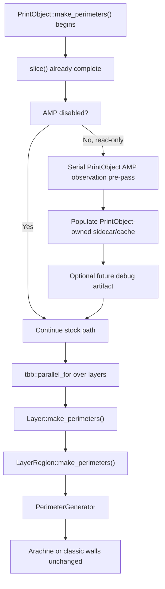

# AMP Read-Only Integration Map

## Purpose

This map identifies the safest first integration boundary for the Adaptive Manufacturing Planner read-only prototype. The goal is to observe geometry and produce planner-owned debug data without changing generated toolpaths, generated G-code, profiles, Arachne behavior, or Snapmaker nozzle validation.

The read-only prototype is a visibility and validation tool, not a manufacturing behavior change.

## Current Pipeline Anchors

### `PrintObject::make_perimeters()`

File:

- `src/libslic3r/PrintObject.cpp`

Relevant behavior:

- Ensures slicing has happened through `this->slice()`.
- Restores untyped slices if needed.
- Performs perimeter-related object/layer setup.
- Runs layer perimeter generation through `tbb::parallel_for`.
- Calls `m_layers[layer_idx]->make_perimeters()` from inside the parallel loop.

Concurrency implication:

- Any AMP data structure shared across layers must not be mutated from inside the `tbb::parallel_for` loop.
- Any future per-layer accumulation must happen before the loop in a serial pass, or use thread-local data with an explicit deterministic merge step after the loop.

### `Layer::make_perimeters()`

File:

- `src/libslic3r/Layer.cpp`

Relevant behavior:

- Dispatches per-region perimeter work for a layer.
- Leads to `LayerRegion::make_perimeters()` for region-specific wall generation.

Concurrency implication:

- This call is reached from the `PrintObject::make_perimeters()` parallel loop.
- It should be treated as part of the parallel perimeter-generation hot path for read-only AMP ownership decisions.

### `LayerRegion::make_perimeters()`

File:

- `src/libslic3r/LayerRegion.cpp`

Relevant behavior:

- Clears existing perimeter and thin-fill outputs.
- Reads `PrintConfig`, `PrintObjectConfig`, and `PrintRegionConfig`.
- Computes effective filament ids.
- Constructs `PerimeterGenerator`.
- Calls Arachne or classic perimeter generation:
  - `g.process_arachne()`
  - `g.process_classic()`

Concurrency implication:

- `LayerRegion::make_perimeters()` is a useful future integration or consumption point because it has the immediate context needed to construct `PerimeterGenerator`.
- It is not the first read-only owner for AMP.
- It is unsafe for shared mutable planner/debug writes because it is reached through parallel execution.

## First Safe Owner

The first safe owner for Stage 0/read-only AMP data should be:

- A PrintObject-owned sidecar, or
- A PrintObject-scoped cache that is populated before `PrintObject::make_perimeters()` enters the parallel layer loop.

This owner should store planner-owned value data only:

- Object id.
- Layer id.
- Region id.
- Geometry summary.
- Stock fallback recommendation.
- Debug/scoring fields.
- Reason codes.

The sidecar/cache must not own or mutate:

- `Flow`
- `PerimeterGenerator`
- Arachne state
- `LayerRegion` generation outputs
- G-code output
- Snapmaker validation state

## Stage 0 Read-Only Observation Rule

The first AMP observation pass must be serial and deterministic.

Allowed Stage 0 behavior:

- Iterate object/layer/region geometry in a stable order.
- Build planner-owned records.
- Emit a future AMP read-only debug artifact.
- Leave generated toolpaths and G-code unchanged.

Disallowed Stage 0 behavior:

- Do not write planner/debug artifacts from inside `LayerRegion::make_perimeters()`.
- Do not write shared planner/debug artifacts from inside the `PrintObject::make_perimeters()` `tbb::parallel_for`.
- Do not consume planner recommendations during perimeter generation.
- Do not alter `Flow`, `PerimeterGenerator`, Arachne, tool assignment, G-code output, profiles, or Snapmaker nozzle validation.

## Future Stage 1 Consumption Point

`LayerRegion::make_perimeters()` may become a useful future Stage 1 consumption point after the read-only path is stable.

Why it is useful later:

- It has access to region config and object config.
- It constructs `PerimeterGenerator`.
- It chooses between Arachne and classic wall generation.
- It is near the future bridge between planned bead-width recommendations and wall-generation inputs.

Why it is not the first owner:

- It is reached through parallel execution.
- Shared mutable debug writes from this function would be unsafe.
- It is part of the wall-generation hot path, which should remain unchanged during Stage 0/read-only work.

Future use should be limited to consuming immutable, precomputed, planner-owned data after equivalence tests and explicit review.

## Deterministic Accumulation Options

Preferred Stage 0 option:

1. Run a serial pre-pass at `PrintObject` scope before the parallel perimeter loop.
2. Populate a PrintObject-owned AMP sidecar.
3. Serialize debug output outside the parallel hot path.
4. Do not feed planner recommendations into wall generation.

Alternative future option:

1. Allocate thread-local per-layer planner/debug records.
2. Populate only thread-local data inside parallel execution.
3. Merge records after the parallel loop in stable object/layer/region order.
4. Serialize debug output after the deterministic merge.

The preferred Stage 0 option is the serial pre-pass. The thread-local strategy should be deferred until there is a measured need.

## Recommended Stage 0 Flow

## Guardrail Checklist

Before the pure value-type stock fallback module is consumed by any integration point:

- The hidden config flag remains default false.
- No generated G-code changes occur.
- No generated toolpath changes occur.
- No profile defaults change.
- No Snapmaker nozzle validation paths change.
- AMP data structures are planner-owned values.
- Stage 0 ownership is PrintObject-scoped, not LayerRegion-owned.
- The first observation pass is serial and deterministic.
- Any future per-layer accumulation has a deterministic merge plan.

## Current Recommendation

Proceed next to the pure value-type stock fallback module only. Do not wire planner ownership into the parallel perimeter-generation path until the data structures, fallback behavior, and serialization boundaries are tested independently.
