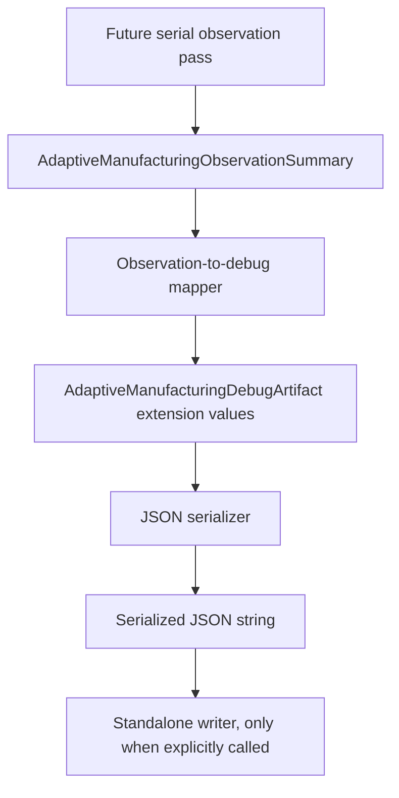

# AMP Observation Debug Artifact Mapping Design

## Purpose

This document defines how future Adaptive Manufacturing Planner observation summaries should become visible in read-only debug artifacts. The goal is to expose observation summary records for developer inspection and regression testing while preserving the separation between observation, planning, serialization, writing, and slicing.

The observation-to-debug mapping is a visibility and validation boundary, not a manufacturing behavior change.

The mapping must preserve:

- read-only behavior;
- generated G-code parity;
- deterministic debug output;
- no production slicer path consuming AMP;
- no default filesystem output.

## Current Branch Context

The AMP branch currently has:

- hidden developer config flag `adaptive_manufacturing_enable`;
- stock fallback AMP value types;
- no-op `AdaptiveManufacturingPlanner` facade;
- sidecar cache value types;
- debug artifact value types;
- debug artifact JSON serializer;
- standalone debug artifact writer utility;
- observation summary value types;
- focused AMP tests passing with 139 assertions in 21 test cases;
- no production slicer path consuming AMP.

This document does not authorize C++ implementation, serializer edits, `PrintObject` wiring, config consumption, geometry inspection, debug artifact emission from slicing, or generated output changes.

## Mapping Boundary

The future mapper should accept already-created `AdaptiveManufacturingObservationSummary` data and convert it into debug-artifact-owned representation.

The mapper may:

- read observation summary entries;
- read observation summary warnings;
- create debug artifact values or a debug artifact extension structure;
- preserve deterministic entry ordering;
- preserve summary-level warnings;
- represent region categories using stable strings.

The mapper must not:

- inspect geometry;
- call `PrintObject`;
- call `LayerRegion`;
- call `Flow`;
- call Arachne;
- call `PerimeterGenerator`;
- call G-code code;
- write files;
- call the standalone writer;
- mutate planner state;
- mutate observation state;
- generate physical nozzle commands;
- bypass Snapmaker validation.

The mapper is a pure data translation boundary. It has no slicing authority and no output authority.

## Proposed Debug Artifact Extension

Future debug artifacts may add an optional top-level field:

```json
{
  "schema_version": "0.1",
  "generation_mode": "enabled_readonly",
  "warnings": [],
  "entries": [],
  "observation_summary": {
    "warnings": [],
    "entries": []
  }
}
```

The `observation_summary` field should be omitted when no observation summary is attached. This keeps stock fallback and no-op debug artifacts small and avoids implying that observation has run when it has not.

## Observation Summary Schema

Top-level `observation_summary` fields:

```json
{
  "warnings": [],
  "entries": []
}
```

Observation entry:

```json
{
  "object_id": 0,
  "layer_id": 0,
  "region_id": 0,
  "region_category": "unknown",
  "observed_item_count": 0,
  "warning_count": 0
}
```

Allowed `region_category` string values:

- `unknown`
- `perimeter`
- `infill`
- `support`

The string values should be lowercase and stable. They are debug schema values, not translated UI labels.

## Data Not Allowed In The Mapping

The observation summary debug representation must not include:

- geometry polygons;
- coordinates;
- toolpaths;
- generated extrusion paths;
- G-code snippets;
- Arachne state;
- Flow mutation data;
- `PerimeterGenerator` state;
- physical nozzle commands;
- printer safety override state;
- Snapmaker validation state;
- host filesystem paths;
- timestamps;
- raw pointers or process-local addresses.

The debug artifact should communicate summary facts only. It must not become a side channel for slicer internals.

## Determinism

Observation summary mapping must be deterministic.

Required behavior:

- Observation entries are sorted by `object_id`, then `layer_id`, then `region_id`.
- Region category strings are stable.
- JSON keys are emitted in stable order.
- Summary warnings preserve insertion order from the observation summary.
- No timestamps are added.
- No host-specific paths are added.
- Repeated mapping of the same input produces identical debug artifact values.
- Repeated serialization of the mapped artifact produces identical JSON.

The existing `AdaptiveManufacturingObservationSummary` value type already returns entries in deterministic object/layer/region order. The mapper should rely on that contract and should not introduce hash-map iteration or worker-thread completion ordering.

## Separation Of Responsibilities

The future data flow should remain layered:



Responsibilities:

- Observation pass: creates summary facts from already-existing slicer state in a future read-only mode.
- Observation summary value types: store deterministic summary records.
- Mapper: translates summary records into debug artifact representation.
- Debug artifact value types: own diagnostic artifact state.
- Serializer: converts artifact values into deterministic JSON.
- Writer: persists an already-serialized string only when explicitly called.

No layer should reach backward into geometry or forward into filesystem output outside its boundary.

## Validation Strategy

Future implementation should be validated before any observation integration.

Unit tests should cover:

- empty observation summary maps to either no `observation_summary` field or an explicit empty summary, whichever the implementation plan chooses;
- summary warnings are preserved;
- entries map in deterministic object/layer/region order;
- `Unknown`, `Perimeter`, `Infill`, and `Support` categories map to stable strings;
- mapped output contains no polygons, coordinates, toolpaths, G-code snippets, Arachne state, Flow mutation data, physical nozzle commands, filesystem paths, or timestamps;
- repeated mapping of the same summary produces identical artifact values;
- serializer output remains deterministic after observation summary mapping.

Reference checks should confirm:

- no production slicer path references the mapper;
- no `PrintObject`, `LayerRegion`, `Flow`, Arachne, `PerimeterGenerator`, G-code export, UI, profiles, Snapmaker validation, or `CalibUtils.cpp` path references the mapper;
- `adaptive_manufacturing_enable` remains unconsumed by the mapper.

Future integration validation remains required before any real observation wiring:

- generated G-code parity before and after read-only observation;
- deterministic debug output across repeated runs;
- no behavior change when `adaptive_manufacturing_enable` is false;
- no default debug artifact output.

## Schema Versioning

Adding `observation_summary` changes the debug artifact schema surface. The first implementation plan should decide whether to:

- keep `schema_version` at `0.1` because the field is optional and developer-only; or
- increment to a future schema version if downstream tooling needs explicit detection.

Whichever policy is chosen, tests must lock it down. The mapper must not silently alter existing no-op artifact output when no observation summary is present.

## Non-Goals

This design explicitly does not include:

- C++ implementation;
- serializer changes;
- writer changes;
- actual observation pass;
- geometry inspection;
- geometry scoring;
- bead-width recommendation;
- `PrintObject` integration;
- `LayerRegion` integration;
- Arachne integration;
- Flow integration;
- `PerimeterGenerator` integration;
- G-code changes;
- profile changes;
- UI changes;
- physical mixed-nozzle behavior;
- Snapmaker validation bypass.

## Cross-References

- `docs/AMP_Branch_Status.md`
- `docs/design/AMP_ReadOnly_Debug_Artifact_Design.md`
- `docs/design/AMP_Debug_Artifact_Writer_Design.md`
- `docs/design/AMP_Serial_ReadOnly_Observation_Design.md`
- `docs/code_maps/AMP_ReadOnly_Integration_Map.md`
- `docs/risks/AMP_Project_Risk_Register_v0.2.md`

## Exit Criteria For Mapping Value/Tests

Before adding mapper C++ or tests, the branch should satisfy:

- observation summary value types remain standalone;
- debug artifact value types remain standalone;
- serializer remains deterministic;
- writer remains standalone and explicitly called only by tests;
- no production slicer path consumes AMP;
- the implementation plan names exact files, tests, schema-version behavior, and whether empty summaries are omitted or serialized explicitly.
