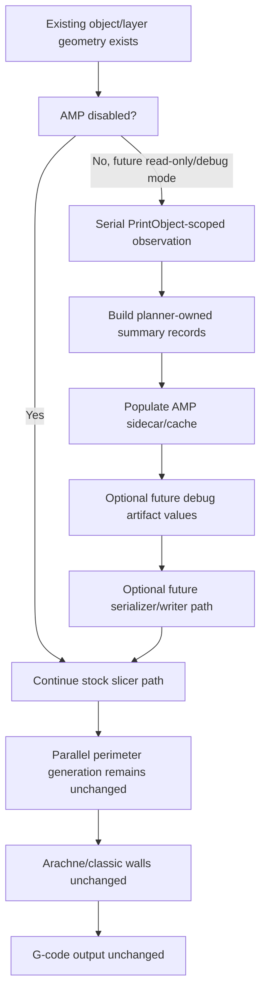

# AMP Serial Read-Only Observation Design

## Purpose

This document defines the first future Adaptive Manufacturing Planner geometry observation pass. The goal is to let AMP observe already-existing slicer geometry in a read-only way, feed future sidecar records and debug artifacts, and prove behavior-neutral operation before any scoring, bead-width planning, or tool/nozzle selection is allowed to affect slicing.

The serial read-only observation pass is a visibility and validation tool, not a manufacturing behavior change.

This design does not authorize C++ implementation, `PrintObject` wiring, config consumption, geometry inspection in code, debug artifact emission from slicing, or generated output changes.

## Current Branch Context

The AMP branch currently has:

- hidden developer config flag `adaptive_manufacturing_enable`;
- stock fallback AMP value types;
- no-op `AdaptiveManufacturingPlanner` facade;
- sidecar cache value types;
- debug artifact value types;
- in-memory JSON serializer;
- standalone debug artifact writer utility;
- focused AMP tests passing with 97 assertions in 16 test cases;
- no production slicer path consuming AMP.

The observation design must preserve that branch posture. AMP may gain observability later, but it must not gain slicing authority in this milestone.

## Observation Boundary

The first observation pass must be serial and deterministic.

Required boundaries:

- No writes inside the `PrintObject::make_perimeters()` `tbb::parallel_for`.
- No writes from `LayerRegion::make_perimeters()`.
- No mutation of `Flow`.
- No mutation of Arachne state.
- No mutation of `PerimeterGenerator`.
- No mutation of generated extrusion paths.
- No mutation of G-code writer state.
- No physical nozzle commands.
- No Snapmaker validation bypass.
- No profile default changes.

The observation pass may create planner-owned value records in a future sidecar/cache. Those records must be separate from slicer-owned toolpath structures and must be disposable without changing generated output.

## Candidate Location

The preferred future location is a PrintObject-scoped observation step that runs before `PrintObject::make_perimeters()` enters its parallel layer loop.

Rationale:

- `PrintObject` is high enough in the pipeline to own object-scoped planner diagnostics.
- It can identify object/layer/region records before region-level wall generation consumes them.
- It avoids shared mutable writes from the layer parallel loop.
- It keeps AMP data outside `Flow`, Arachne, `PerimeterGenerator`, and G-code export.
- It matches the existing sidecar cache design, which treats AMP data as a PrintObject-owned or PrintObject-scoped derived cache.

`LayerRegion::make_perimeters()` is not the first writer location.

Why it is not first:

- It is reached from the `PrintObject::make_perimeters()` parallel layer loop.
- It is part of the wall-generation hot path.
- Shared planner/debug writes from this function would require synchronization or thread-local accumulation.
- It is too close to `Flow`, Arachne, and `PerimeterGenerator` to be the first behavior-neutral observation boundary.

`LayerRegion::make_perimeters()` may remain a future Stage 1 consumption point after a read-only path is proven. In that future, it should consume immutable precomputed AMP records only after equivalence tests and explicit review.

## Future Per-Layer Data Collection

The preferred first approach is a serial pre-pass:

1. Existing slicing creates object/layer/region structures.
2. A future AMP observation step iterates those structures in stable order.
3. The step builds planner-owned summary records.
4. The records are stored in a PrintObject-scoped sidecar/cache.
5. Stock perimeter, infill, support, and G-code generation continue unchanged.

If later performance work requires observation during threaded execution, the only acceptable pattern is thread-local accumulation plus deterministic merge:

1. Each worker writes only to thread-local observation records.
2. Each record carries stable object/layer/region keys.
3. The parallel loop completes.
4. A serial merge sorts and validates records.
5. Debug artifact construction reads only the merged result.

Thread-local observation is a future optimization, not the first implementation path.

## Initial Observed Data

The first observation records should be summaries only.

Allowed fields:

- `object_id`;
- `layer_id`;
- `region_id`;
- region type or category if safely available without invoking wall generation or mutating state;
- coarse counts that are already available at the observation boundary;
- coarse summary flags that are stable and cheap to derive;
- stock fallback recommendation metadata.

The initial observation pass must not store:

- geometry polygons;
- coordinates;
- toolpath coordinates;
- generated extrusion paths;
- G-code snippets;
- Arachne internal state;
- `Flow` objects;
- `PerimeterGenerator` instances;
- physical toolhead/nozzle state;
- Snapmaker validation state;
- raw pointers or process-local addresses;
- timestamps.

If a candidate field requires entering wall generation, reading mutable generator state, or capturing path-level geometry, it is out of scope for the first read-only observation pass.

## Data Flow

Recommended future flow:

The debug artifact serializer and standalone writer already exist as isolated utilities. A future observation pass must not call the writer from inside parallel slicer execution.

## Determinism

Determinism is required for regression testing and normalized G-code parity checks.

Required deterministic behavior:

- stable object ordering;
- stable layer ordering;
- stable region ordering;
- stable merge behavior;
- no timestamps;
- no host-specific paths in equivalence-sensitive artifacts;
- no pointer addresses;
- no worker-thread completion ordering;
- no random identifiers;
- repeatable debug artifacts for the same model, profile, and AMP mode.

If duplicate observation records can occur in a future implementation, duplicate handling must be explicit. The first version should prefer rejecting duplicates in tests over accepting last-writer-wins behavior.

## Validation Strategy

Validation must prove that observation is read-only before any scoring or planning logic is introduced.

Required checks for a future implementation:

- Generated G-code parity before and after enabling read-only observation.
- Deterministic debug output across repeated runs on the same input.
- No behavior change with `adaptive_manufacturing_enable` false.
- No debug output unless an explicit future developer debug mode exists.
- No production slicer path consumes AMP unless an explicit future debug mode is reviewed and tested.
- No references from production wall generation to mutable AMP observation output.
- No writes inside the `PrintObject::make_perimeters()` `tbb::parallel_for`.
- No writes from `LayerRegion::make_perimeters()`.

Recommended test levels:

- Unit tests for observation record ordering and duplicate handling.
- Unit tests for sidecar/cache insertion and deterministic iteration.
- Serializer tests proving stable output from observation summaries.
- Writer tests proving exact persisted bytes when explicitly called.
- Integration parity tests proving generated G-code is unchanged with read-only observation enabled.

## Relationship To Later Scoring

The observation pass must not assign manufacturing strategy.

It may provide future inputs for:

- region scoring;
- confidence calculation;
- bead-width recommendation summaries;
- preview/debug overlays;
- benchmark comparison tooling.

Those later consumers must be introduced separately. The first observation pass should produce facts and stock fallback metadata only, not recommendations that influence slicer behavior.

## Non-Goals

This design explicitly does not include:

- C++ implementation;
- `PrintObject` integration;
- consuming `adaptive_manufacturing_enable`;
- geometry inspection in code;
- debug artifact emission from slicing;
- geometry scoring;
- bead-width recommendations;
- Arachne integration;
- Flow integration;
- `PerimeterGenerator` integration;
- `LayerRegion` integration or consumption;
- G-code changes;
- profile changes;
- UI changes;
- physical mixed-nozzle behavior;
- Snapmaker validation bypass.

## Cross-References

- `docs/AMP_Branch_Status.md`
- `docs/design/AMP_PrintObject_Sidecar_Cache_Design.md`
- `docs/design/AMP_ReadOnly_Debug_Artifact_Design.md`
- `docs/design/AMP_Debug_Artifact_Writer_Design.md`
- `docs/code_maps/AMP_ReadOnly_Integration_Map.md`
- `docs/risks/AMP_Project_Risk_Register_v0.2.md`

## Exit Criteria For Observation Summary Value Types

Before adding observation summary value types, the branch should satisfy:

- no production slicer path consumes AMP;
- writer utility remains standalone and explicitly called only by tests;
- serializer remains deterministic and in-memory;
- sidecar cache remains detached from `PrintObject`;
- the value-type implementation plan names exact files and tests;
- the first summary values contain no polygons, coordinates, toolpaths, G-code snippets, or generator state.
